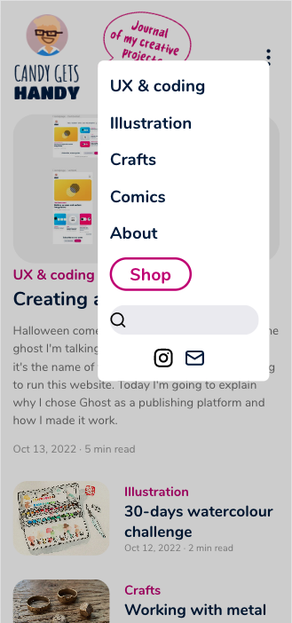

# Theme for a Ghost website

I created this custom theme for a personal publishing platform hosted on [Ghost](https://ghost.org/). The back-end is hosted on Digital Ocean and this customised theme is deployed to my Ghost website via GitHub Actions.

> ***Please note that this  theme is still a work in progress. In its current form, you shouldn't install it in your production environment***

## Overview

### Screenshot (mobile view)

### Link

- Live Site URL: [https://candygetshandy.com/](https://candygetshandy.com/)

## My process

I started by installing Ghost locally via [Ghost CLI](https://ghost.org/docs/ghost-cli/). Working from the Figma files and the different visual assets I designed, I integrated them to the theme via a single CSS file. I developed for mobiles first and made the website fully responsive. I then installed Ghost on a [Digital Ocean](https://www.digitalocean.com/) droplet and deployed the theme via [GitHub Actions](https://ghost.org/integrations/github/).

You can read more about my entire process on this [blog post](https://candygetshandy.com/creating-a-ghost-theme/).

### What I learned

Ghost is the perfect platform for the type of content I want to publish: written articles with photos, mixed with comics in a webtoon format that can be easily read on mobile devices. Also, it seemed that working from an existing theme was faster than retrieving the articles via the Ghost API and creating the theme entirely from scratch, so I could quiclky focus on writing content.

However, having to rely on CSS only to develop this theme has been a big hurdle, especially when it came to adapting multiple image formats and making them responsive in every situation. In the end, I spent more time trying to adjust small visual details rather than working on the structure itself.

### Continued development

In a future version, I plan to work differently and get the content via the Ghost API, and create a front-end entirely from scratch in order to suit my requirements perfectly.

## Author

- Website - [Candice Fairand Web Dev Portfolio](https://www.candicefairand.com)
- Blog - [Candy Gets Handy](https://candygetshandy.com/)
